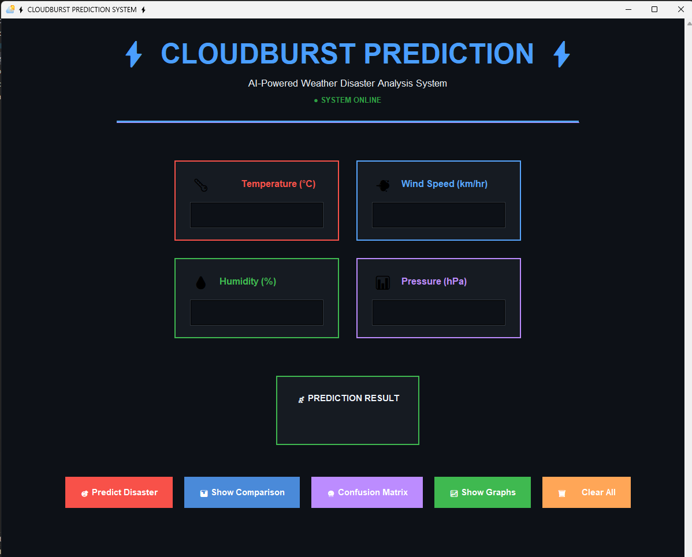

# ⚡ CLOUDBURST PREDICTION SYSTEM ⚡



## 🌟 Overview

An **AI-Powered Weather Disaster Analysis System** that predicts cloudburst events using machine learning. The application features a modern, futuristic dark-themed UI with advanced visualization capabilities and real-time predictions.

## ✨ Features

### 🎨 Modern Futuristic UI
- **Dark Theme Design**: GitHub-inspired dark color scheme with neon accents
- **Centered Layout**: Perfectly centered and balanced design
- **Animated Elements**: 
  - Pulsing title and status indicators
  - Loading bar animations
  - Button hover effects with glow
- **Color-Coded Cards**: Each weather parameter has its own themed color
  - 🌡️ Temperature - Red
  - 💨 Wind Speed - Cyan
  - 💧 Humidity - Green
  - 📊 Pressure - Purple

### 🎠 Carousel Navigation
- **Graph Carousel**: Navigate through multiple visualizations without overlay
- **Interactive Controls**: 
  - ◀ Previous / Next ▶ buttons
  - Clickable dot indicators
  - Visual active state feedback
- **Three Main Visualizations**:
  1. 📊 Input Comparison Analysis
  2. 🔮 Model Performance Matrix
  3. 📈 Weather Data Analysis Dashboard

### 🤖 Machine Learning
- **Random Forest Classifier**: Trained on historical weather data
- **Input Parameters**:
  - Temperature (°C)
  - Wind Speed (km/hr)
  - Humidity (%)
  - Atmospheric Pressure (hPa)
- **Real-time Predictions**: Instant disaster risk assessment

### 📊 Data Visualization
- **Comparison Charts**: Compare your input with dataset averages
- **Confusion Matrix**: Model performance visualization
- **Time-Series Graphs**: Weather parameter trends over time
- **Dark Theme Plots**: All visualizations use futuristic dark styling

### 🔧 Enhanced Functionality
- **Input Validation**: Ensures all fields are filled before prediction
- **Error Handling**: Graceful error messages and warnings
- **Scrollable Interface**: Smooth scrolling for all content
- **Responsive Design**: Adapts to different window sizes

## 🚀 Installation

### Prerequisites
- Python 3.8 or higher
- pip package manager

### Setup

1. **Clone the repository**
```bash
git clone https://github.com/Tharun-M-16/CLOUDBURST-PREDICTION-SYSTEM.git
cd CLOUDBURST-PREDICTION-SYSTEM
```

2. **Create a virtual environment** (recommended)
```bash
python -m venv .venv
```

3. **Activate virtual environment**
   - Windows:
     ```bash
     .venv\Scripts\activate
     ```
   - Linux/Mac:
     ```bash
     source .venv/bin/activate
     ```

4. **Install required packages**
```bash
pip install pandas numpy scikit-learn matplotlib seaborn
```

## 📦 Required Packages

```txt
pandas
numpy
scikit-learn
matplotlib
seaborn
```

## 🎮 Usage

1. **Run the application**
```bash
python disaster_prediction_model_final.py
```

2. **Enter weather parameters**
   - Temperature in °C
   - Wind Speed in km/hr
   - Humidity in %
   - Atmospheric Pressure in hPa

3. **Use the action buttons**
   - 🎯 **Predict Disaster**: Get AI prediction for cloudburst risk
   - 📊 **Show Comparison**: Compare your input with dataset averages
   - 🔮 **Confusion Matrix**: View model performance metrics
   - 📈 **Show Graphs**: Display weather data trends
   - 🗑️ **Clear All**: Reset all input fields

4. **Navigate through graphs**
   - Use ◀ Previous / Next ▶ buttons
   - Click indicator dots to jump to specific graphs
   - Only one graph displays at a time (carousel mode)

## 📁 Project Structure

```
CLOUDBURST-PREDICTION-SYSTEM/
│
├── disaster_prediction_model_final.py    # Main application file
├── processed_disaster_data.csv           # Historical weather data
├── refined_disaster_prediction_model.pkl # Trained ML model
├── logo.ico                              # Application icon
├── README.md                             # Project documentation
└── screenshot.png                        # UI screenshot
```

## 🎨 Color Scheme

| Color | Hex Code | Usage |
|-------|----------|-------|
| Background | `#0d1117` | Main background |
| Card BG | `#161b22` | Card backgrounds |
| Cyan | `#58a6ff` | Primary accent, Wind Speed |
| Purple | `#bc8cff` | Pressure, Navigation buttons |
| Green | `#3fb950` | Humidity, Success states |
| Red | `#f85149` | Temperature, Alerts |
| Orange | `#ffa657` | Clear button |
| Text | `#f0f6fc` | Primary text |
| Muted | `#8b949e` | Secondary text |

## 🧠 Model Information

- **Algorithm**: Random Forest Classifier
- **Training Version**: scikit-learn 1.5.2
- **Features Used**: Temperature, Wind Speed, Humidity, Pressure
- **Output**: Binary classification (Disaster/No Disaster)

## 🛠️ Technical Details

### Technologies Used
- **Python 3.13**
- **Tkinter**: GUI framework
- **Matplotlib**: Data visualization
- **scikit-learn**: Machine learning
- **Pandas**: Data processing
- **NumPy**: Numerical computations

### Key Features Implementation
- **Animation System**: Tkinter's `after()` method with graceful shutdown
- **Carousel Pattern**: Custom implementation with state management
- **Responsive Canvas**: Dynamic scroll region updates
- **Error Handling**: Try-except blocks with user-friendly messages

## ⚠️ Known Issues

- Emoji glyphs may not display correctly on all systems (font limitation)
- Model was trained with scikit-learn 1.5.2, may show warnings on newer versions

## 🔮 Future Enhancements

- [ ] Add more weather parameters (rainfall, dewpoint)
- [ ] Implement real-time weather API integration
- [ ] Add historical prediction logs
- [ ] Export reports as PDF
- [ ] Multi-language support
- [ ] Mobile-responsive web version

## 👨‍💻 Author

**Tharun M**
- GitHub: [@Tharun-M-16](https://github.com/Tharun-M-16)

## 📄 License

This project is open source and available for educational purposes.

## 🙏 Acknowledgments

- Weather data source: Historical meteorological records
- UI Design inspiration: Modern dark themes
- Machine Learning framework: scikit-learn community

## 📞 Support

If you encounter any issues or have questions:
1. Check the Issues section on GitHub
2. Create a new issue with detailed description
3. Include error messages and screenshots

---

**⚡ Stay Safe, Predict Smart! ⚡**

*Last Updated: December 30, 2025*
